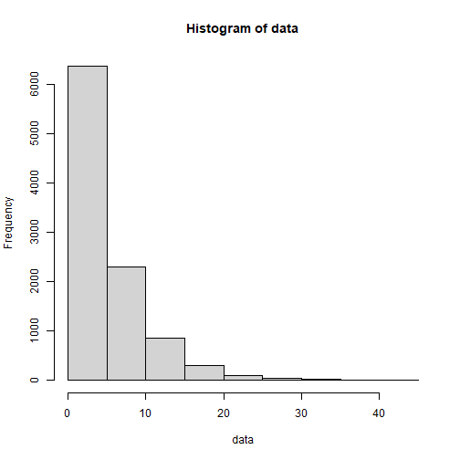
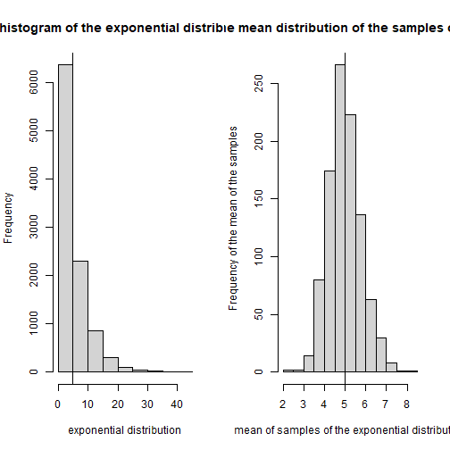
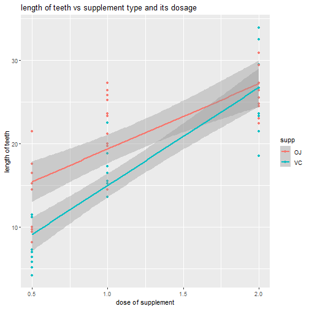

# Part1. A simulation exercise.
populating the exponitial distribution of size 10k

```r
#setting lambda = 0.2
data = rexp(10000, 0.2)
hist(data)
```



```r
#mean and std dev of the data should be 1/lambda = 5 approx
mean_data = mean(data)
sd_data = sd(data)
var_data = var(data)
```

Now let us create the distribution of the 1000 averages of the 40 exponentials by extracting the 40 samples from the population and repeating it 1000 times and creating the 40x1000 matrix.  
This matrix contains 1000 columns, with each column containing 40 samples from the population.  
If we take a average of each column , it can be considered as the new distribution of averages.


```r
sample_data =  matrix(sample(data, size = 40*1000, replace = T), 40, 1000)
mean_distribution_data = colMeans(sample_data)
```

We can calculate the mean and std deviation of the new distribution and compare it with the original population and can verify the central limit thoerem.

```r
paste('mean of the population', mean_data, sep = '=')
```

```
## [1] "mean of the population=4.92505507192127"
```

```r
paste('std dev of the population', sd_data, sep = '=')
```

```
## [1] "std dev of the population=4.87680428961435"
```

```r
paste('variance of the population', var_data, sep = '=')
```

```
## [1] "variance of the population=23.7832200792009"
```

```r
#Theoritical values of the distribution averages according to CLT
paste('Threoritical mean of the population should be = mean_data', mean_data, sep = '=')
```

```
## [1] "Threoritical mean of the population should be = mean_data=4.92505507192127"
```

```r
paste('Threoritical std dev of the population should be = sd_data/sqrt(40)', sd_data/sqrt(40), sep = '=')
```

```
## [1] "Threoritical std dev of the population should be = sd_data/sqrt(40)=0.771090462903038"
```

```r
paste('Threoritical variance of the population should be = var_data/40', var_data/40, sep = '=')
```

```
## [1] "Threoritical variance of the population should be = var_data/40=0.594580501980022"
```

```r
#Practival values of the distribution averages
paste('actual mean of the population', mean(mean_distribution_data), sep = '=')
```

```
## [1] "actual mean of the population=4.97845598784188"
```

```r
paste('actual std dev of the population', sd(mean_distribution_data), sep = '=')
```

```
## [1] "actual std dev of the population=0.792861689577695"
```

```r
paste('actual variance of the population', var(mean_distribution_data), sep = '=')
```

```
## [1] "actual variance of the population=0.628629658799997"
```

Also, according to the Central Limit Thoerem this new distribuition of averages should follow normal distribution irrespective of the normality of the population distribution.

```r
par(mfcol = c(1,2))
hist(data, xlab = 'exponential distribution', ylab = 'Frequency',
     main = 'histogram of the exponential distribuion')
abline(v = mean(data))
hist(mean_distribution_data, xlab = 'mean of samples of the exponential distribution',
     ylab = 'Frequency of the mean of the samples',
     main = 'histogram of the mean distribution of the samples of exponential data')
abline(v = mean(mean_distribution_data))
```



Thus, the new distribution of mean of the samples follows Normal distribution even though population is not normally distributed.  
Mean of the new distribution is nearly equal to population.  
Variance of the new distribution is related to population as -> new_var = old_var/sample_size

# Part2. Basic inferential data analysis.
## Load the ToothGrowth data and perform some basic exploratory data analyses.

```r
library(datasets)
data("ToothGrowth")
library(ggplot2)
ggplot(data = ToothGrowth, aes(x = dose, y = len, color = supp))+
      geom_point()+
      geom_smooth(method = 'lm')+
      ylab('length of teeth')+
      xlab('dose of supplement')+
      ggtitle('length of teeth vs supplement type and its dosage')
```

```
## `geom_smooth()` using formula 'y ~ x'
```



As we can see from the above plot, the length of the teeth increases with increase in dose of the supplement. Also the growth with 'VC' supplement is more than 'OJ', supplement when the dosage is less, but as the dosage increases 'OJ' supplement is more effective than 'VC' supplement.

## Provide a basic summary of the data.

```r
summary(ToothGrowth)
```

```
##       len        supp         dose      
##  Min.   : 4.20   OJ:30   Min.   :0.500  
##  1st Qu.:13.07   VC:30   1st Qu.:0.500  
##  Median :19.25           Median :1.000  
##  Mean   :18.81           Mean   :1.167  
##  3rd Qu.:25.27           3rd Qu.:2.000  
##  Max.   :33.90           Max.   :2.000
```

```r
#mean of the length of ToothGrowth is 18.81
summary(ToothGrowth[ToothGrowth$supp == 'VC',])
```

```
##       len        supp         dose      
##  Min.   : 4.20   OJ: 0   Min.   :0.500  
##  1st Qu.:11.20   VC:30   1st Qu.:0.500  
##  Median :16.50           Median :1.000  
##  Mean   :16.96           Mean   :1.167  
##  3rd Qu.:23.10           3rd Qu.:2.000  
##  Max.   :33.90           Max.   :2.000
```

```r
#mean of the length of ToothGrowth with supplement 'VC'is 16.96
summary(ToothGrowth[ToothGrowth$supp == 'OJ',])
```

```
##       len        supp         dose      
##  Min.   : 8.20   OJ:30   Min.   :0.500  
##  1st Qu.:15.53   VC: 0   1st Qu.:0.500  
##  Median :22.70           Median :1.000  
##  Mean   :20.66           Mean   :1.167  
##  3rd Qu.:25.73           3rd Qu.:2.000  
##  Max.   :30.90           Max.   :2.000
```

```r
#mean of the length of ToothGrowth with supplement 'OJ'is 20.66
```

## Use confidence intervals and/or hypothesis tests to compare tooth growth by supp and dose.

```r
t.test(ToothGrowth$len, data = ToothGrowth, paired = FALSE, conf.level = 0.95)$conf
```

```
## [1] 16.83731 20.78936
## attr(,"conf.level")
## [1] 0.95
```

The mean of the lengths with supplement 'VC' and 'OJ' lie in the 95% confidence interval, so we can conclude that there is not difference in teethgrowth between the the  two supplements.

## State your conclusions and the assumptions needed for your conclusions.
For small dosage there is difference in teethgrowth between two supplements, but higher dosage the diffence in teethgrowth between two supplents is very less. We assume that population is normally distributed.
